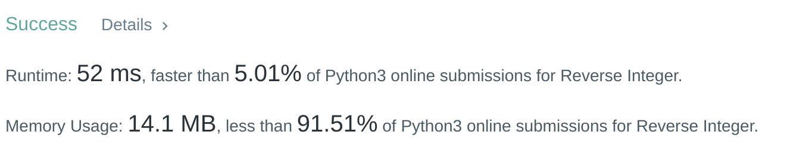

## Transition

Hey folks. In this odd little corner of the web, I probably get a few hundred hits a day, mostly for the niche articles and how-to's that I've had to solve pretty much blind (I'm looking at you, Gatsby and Raygun). However, I've recently gone back to graduate school at Northeastern University  for my MSCS, and I'm taking this time to really learn the fundamentals, and part of that is of course, the interview. For interview prep, I'll be working through Leetcode, Hackerrank, Code Wars, and whatever other resources strike my fancy. It won't be my first time in these platforms, but it will be my first time writing about them, so bear with me. If something seems off, you can contact me below, and I'll swing back by and round out any errors.

So anyways, cheers. I'll be working through them in either Python or Rust. Professionaly, I was a JS guy, but I'm working on moving away from that in the future. I believe the old joke goes, "There are languages people hate, and there are languages people don't use". So I'm taking a wee break from the JavaScript and really checking if that adage is true. 

## The Problem.

Whew. Glad to have that long winded explanation out of the way. 

Let's start by looking at the problem. 

<em>Given a signed 32-bit interger x, return x with its digits reversed. If reversing x causes the value to go outside the signed 32-bit range [-2^31, 2^31 -1], return 0.

Assume the environment does not allow you to store 64-bit intergers (signed or unsigned). 
</em>

Alright. So right off the bat, we can see three things. One, there is a range that the number can be within. It cannot be smaller or larger than a i32 interger, if it is, we return 0. Let's add that real quick.

Starting with our helper code...

```python
class Solution:
    def reverse(self, x:int) -> int:
        result = 0

        if x > 0:

        if x < 0:

        if result <= -2**31 or result >= 2**31:
            return 0
        else:
            return result


```

So that gives us a foundation. Next, we need to look at how to reverse an integer. There are a number of ways to do this, but in python, this is pretty easy. We can convert our int to a string, and then reverse it with x[::-1]. 

But wait! What if our number is negative? If it's negative, then that negavite sign will be reversed to the _end_ of the string as well. We don't want that, because that's just not a number. 

To get around that, we'll multiply our input value by a negative, and then re-add the negative sign at the beginning in string form.

Then for both groups, we'll convert our reversed strings back to an int, and return that result value. 

```python
class Solution:
    def reverse(self, x:int) -> int:
        result = 0

        if x > 0:
            result = int(str(x)[::-1])
        if x < 0:
            result = int(("-" + str(x *-1)[::-1]))
        if result <= -2**31 or result >= 2**31:
            return 0
        else:
            return result


```

Let's give that a go. 



It works!

I'll add the rust solution later tonight, it works just a bit differently, since it doesn't have such an easy string reverse (that I know of), so it ends up using just a little bit of math. 